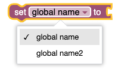
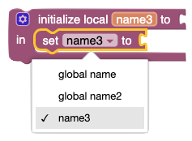
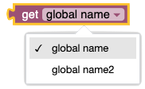

# blockly-block-lexical-variables [](https://github.com/google/blockly)

This plugin adds a set of [Blockly](https://www.npmjs.com/package/blockly) 
blocks that support lexical (aka local) variables, as well as a dynamic UI
for obtaining variable and parameter getters and setters and for renaming variables.
It  also updates the UI for existing blocks that are implicitly lexically scoped,
i.e.:
* Function/Procedure definitions
* For loops

For variable getter and setter blocks this
plugin also provides for dropdowns which allow the user to change the variable
name to any variable allowed by scope.  The plugin will also mark any variable blocks
that are moved out of their allowable scope.

The plugin also adds a dropdown for procedure call blocks, allowing the user to
change the call to be any other procedure of the same basic shape (i.e. statement
shape or expression shape).

This plugin is based on code originally written for 
[MIT App Inventor](https://appinventor.mit.edu).

You can see a demo version of a Blockly app that has integrated this plugin
[here](https://mit-cml.github.io/lexical-variable-demo/).  The code for that
demo is [here](https://github.com/mit-cml/lexical-variable-demo).

## Blocks
### Lexical/local variable declarations
**Block type: 'local-declaration-statement'** - The variable name will be scoped to be valid
within the body of the block.


While hovering over the variable name:


<div id="local-declration-expr" />

**Block type: 'local-declaration-expression'** - A lexical variable declaration which can return a value.
The variable name will be scoped to be valid within blocks attached to the "in" input. The
[Do with result](#do-with-result) block is a particularly useful bloc to be attached to the "in"
input.


While hovering over the variable name:


### Global variable declaration
**Block type: 'global-declaration-statement'** - An block which declares a global variable. The
variable name is scoped to the entire program.


and while hovering over the variable name:


<div id="do-with-result" />

## Variable/Parameter setters and getters
### Setter
**Block type: 'lexical-variable-setter'** - Note that despite the block type name, the 
same block is used for global variables, local variables, loop variables and 
function/procedure parameters.  The names that appear in the dropdown will change
according to the placement of the block.  I.e., it will show the variables that are
in scope for that getter according to which blocks it is within.





###Getter
**Block type: 'lexical-variable-getter'** - Exactly analoous to the setter block.





### Do with result
**Block type: 'controls_do_then_return'** - A block which enable a sequence of statements and a return value.
This block particularly useful with the [Local declaration expression](#local-declration-expr) block


## Loops
### For
**Block type: 'controls_for'** - A block which enables a `for` loop


## Functions/procedures

_More explanation and pretty pictures to come!_

## Notes
We do not yet support the text, math and list blocks which contain implicit variables.
That is still to come!

## Installation

### Yarn
```
yarn add @mit-app-inventor/blockly-block-lexical-variables
```

### npm
```
npm install @mit-app-inventor/blockly-block-lexical-variables --save
```

## Usage

### Import
```js
import * as Blockly from 'blockly';
import * as LexicalVariables from '@mit-app-inventor/blockly-block-lexical-variables';
...
const workspace = Blockly.inject(...);
...
// Load lexical variable plugin
LexicalVariables.init(workspace);
```

## Credits
As mentioned earlier, this plugin is based on code written for
[MIT App Inventor](https://github.com/mit-cml/appinventor-sources). The lexical 
variable implementation (and supporting blocks and UI) in App Inventor was
developed primarily by **Lyn Turbak** but has had many contributors over the years
including (in roughly chronological order):
* Sharon Perl
* Andrew McKinney
* Hal Abelson
* PMW
* Ralph Morelli
* Jeffry Schiller
* Jose Flores
* Joanie Weaver
* Shirley Lu
* mphox
* Leo Burd
* Dave Wolber
* Harry Davis
* WeiHua Li
* jbensal
* Shruti Rijhwani
* Liz Looney
* Evan Patton
* Susan Lane
* Colin Yang
* Beka Westberg
* Siddharth
* Mark Friedman

If you contributed to this code at some point and I somehow neglected to 
mention you, I apologise.  Let me know, file a bug or just submit a pull request
on this file.
## License
Apache 2.0
